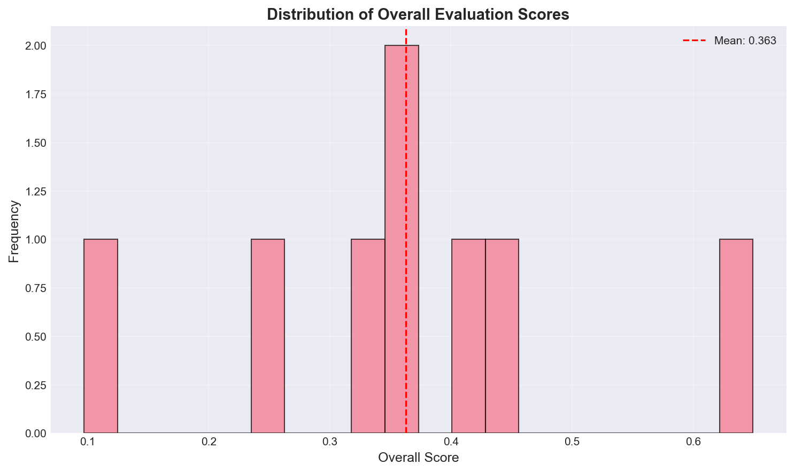

🧠 LLM Evaluation Toolkit

A modular, extensible, production-grade framework for evaluating Large Language Model (LLM) outputs with reproducible metrics, configurable pipelines, and automated reporting.

🚀 Overview

Evaluating LLM outputs consistently is still one of the most difficult challenges in AI development.
Different models hallucinate, paraphrase, compress, omit details — and standard metrics alone (BLEU/ROUGE) cannot capture the nuance of quality.

The LLM Evaluation Toolkit provides a reproducible, multi-metric, fully configurable evaluation system for:

LLM researchers

AI safety teams

ML engineers

Product teams validating AI features

Anyone benchmarking GPT, Claude, Gemini, or custom models

It is modular, metrics-driven, and built for real-world usage.

✨ Key Features

Multi-Metric Evaluation

Exact Match

Fuzzy Matching

Keyword Coverage

Semantic Similarity (Sentence Transformers)

Configurable Pipelines via YAML/JSON

Batch Evaluation

Automatic Report Generation (Markdown + charts)

Extensible Architecture — add your own metrics in minutes

Synthetic Dataset Generation for testing workflows

Research-ready and production-friendly

🧭 Why This Toolkit Matters

Most teams evaluating LLMs end up with:

❌ inconsistent results
❌ ad-hoc scripts
❌ no reproducibility
❌ different evaluators producing different judgments

This toolkit solves that by providing:

✔ A standard evaluation pipeline
✔ Quantitative + semantic scoring
✔ Unified configuration
✔ Replicable scoring logic
✔ Automatic reports for auditability

Companies like OpenAI, Anthropic, DeepMind, and Scale AI all use similar internal frameworks to evaluate models.
This project gives you a clean, open-source version of that capability.

🛠️ Installation
# Clone the repository
git clone https://github.com/SamAde1203/llm-evaluation-toolkit.git
cd llm-evaluation-toolkit

# Install dependencies
pip install -r requirements.txt

⚡ Quick Start
from llm_eval.evaluator import LLMEvaluator

predictions = [
    "The capital of France is Paris.",
    "Water boils at 100°C."
]

references = [
    "Paris is the capital of France.",
    "Water boils at 100 degrees Celsius."
]

# Initialize default evaluator
evaluator = LLMEvaluator()

# Run batch evaluation
results = evaluator.evaluate_batch(predictions, references)

# Print summary in console
evaluator.print_summary()

# Save results
evaluator.save_results(results, "results/evaluation.json")

📊 Evaluation Metrics
Metric	Description	Best For
Exact Match	Normalized string comparison	Factual Q&A
Fuzzy Match	Levenshtein similarity	Typos, near-match text
Keyword Match	Coverage of key factual tokens	Factual completeness
Semantic Similarity	Embedding-based cosine similarity	Paraphrase equivalence
🏗️ Project Structure

A clean, production-grade repository:

llm-evaluation-toolkit/
├── README.md
├── CONTRIBUTING.md
├── CODE_OF_CONDUCT.md
├── LICENSE
│
├── configs/
│   ├── default.yaml
│   └── advanced_config.yaml
│
├── src/
│   ├── evaluator.py
│   ├── datasets.py
│   ├── config.py
│   ├── utils.py
│   └── metrics/
│       ├── correctness.py
│       ├── relevance.py
│       └── safety.py
│
├── examples/
│   ├── demo.py
│   ├── comprehensive_demo.py
│   ├── quickstart.ipynb
│   └── custom_metrics.py
│
├── tests/
│   ├── test_metrics.py
│   ├── test_evaluator.py
│   └── test_datasets.py
│
├── reports/
└── data/

🧩 Advanced Configuration (YAML)
metrics:
  exact_match:
    enabled: true
    normalize: true

  fuzzy_match:
    enabled: true
    threshold: 0.7

  keyword_match:
    enabled: true

  semantic_similarity:
    enabled: true
    model_name: "all-MiniLM-L6-v2"

weights:
  exact_match: 0.3
  fuzzy_match: 0.2
  keyword_match: 0.2
  semantic_similarity: 0.3

output:
  save_results: true
  output_dir: "data/results/"
  generate_report: true

🧠 System Architecture

(Replace the placeholder path with your actual architecture image)

📈 Sample Output
Console Summary
Total Samples: 8
Metrics Used: exact_match, fuzzy_match, keyword_match, semantic_similarity

AGGREGATE SCORES:
semantic_similarity : 0.810 (±0.209)
keyword_match       : 0.473 (±0.248)
exact_match         : 0.000
fuzzy_match         : 0.125
overall             : 0.363

Example Visualization

🧪 Testing
python -m pytest tests/

🔮 Roadmap

LLM-as-Judge scoring (GPT-4, Claude, Gemini)

BLEU, ROUGE, METEOR support

Toxicity & safety classifiers

Web dashboard interface

API endpoints for remote evaluation

Model benchmarking suite

HuggingFace integration

🤝 Contributing

Contributions are warmly welcome!
See: CONTRIBUTING.md

📄 License

MIT — free to use, modify, and distribute.

📚 Citation
@software{llm_evaluation_toolkit,
  title  = {LLM Evaluation Toolkit},
  author = {Adeyemi, Sam},
  year   = {2025},
  url    = {https://github.com/SamAde1203/llm-evaluation-toolkit}
}

❤️ Built for the AI Research & Engineering Community

This toolkit was created to make LLM evaluation transparent, reproducible, and scientifically rigorous.