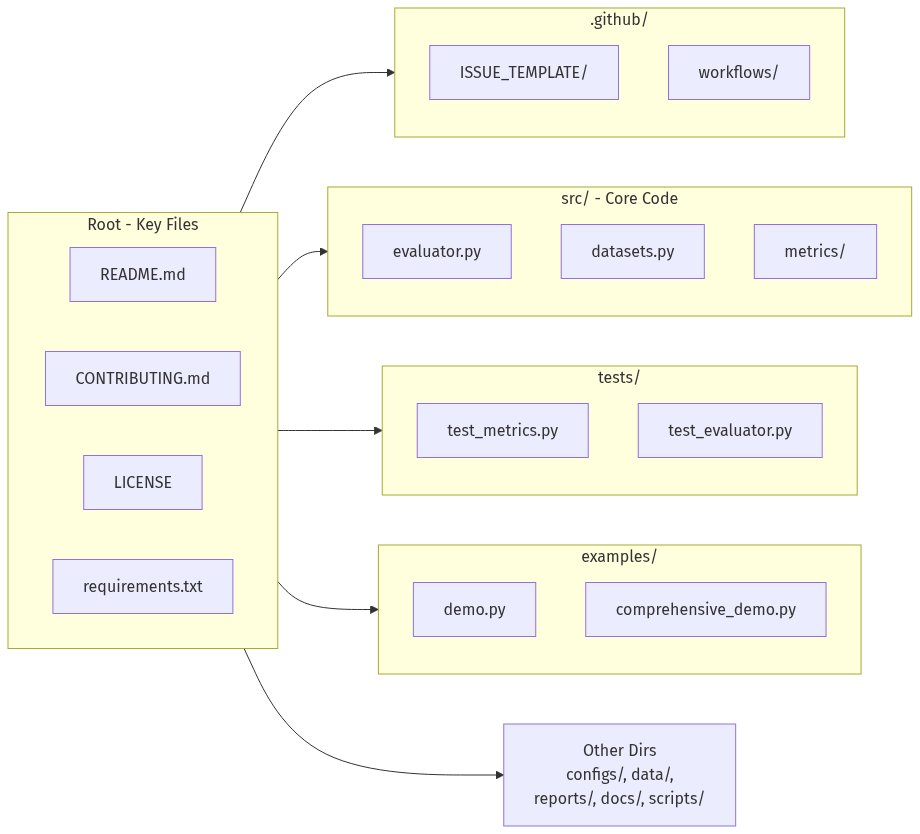
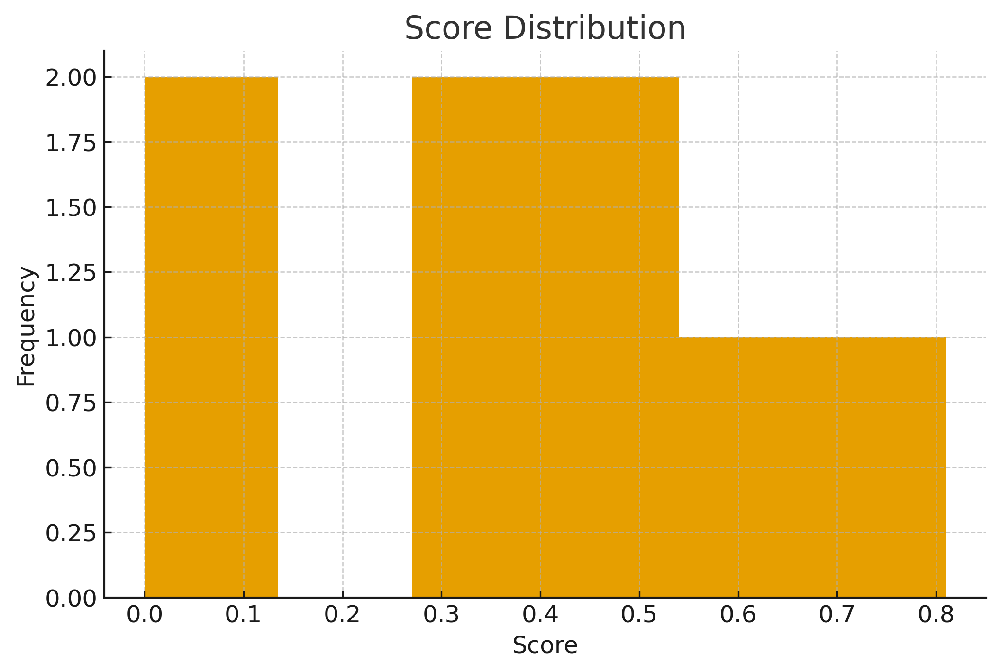

# 🧠 LLM Evaluation Toolkit

[](https://www.python.org/downloads/)
[](https://opensource.org/licenses/MIT)
[](https://github.com/psf/black)
[](https://github.com/SamAde1203/llm-evaluation-toolkit/issues)
[](https://github.com/SamAde1203/llm-evaluation-toolkit/stargazers)

A **production-grade, extensible framework** for evaluating Large Language Model (LLM) outputs using multiple metrics, configurable pipelines, and automated reporting. Built for AI researchers, ML engineers, and product teams who need **reliable, reproducible evaluation at scale**.

---

## 🚀 Why This Toolkit Matters

**Evaluating LLM outputs consistently is one of the hardest challenges in AI development.** Different models hallucinate, paraphrase, compress, or omit details — and classic metrics like BLEU/ROUGE often fail to capture semantic meaning.

### The Problem
Most teams evaluating LLMs end up with:
- ❌ **Inconsistent results** across different evaluators
- ❌ **Ad-hoc scripts** that can't be reproduced
- ❌ **No standard pipeline** for comparing models
- ❌ **Different judgments** for the same output

### Our Solution
The LLM Evaluation Toolkit provides:
- ✅ **Standardized evaluation pipeline** for consistent results
- ✅ **Quantitative + semantic scoring** across multiple dimensions
- ✅ **Unified YAML/JSON configuration** for reproducibility
- ✅ **Automated reports** with visualizations for auditability
- ✅ **Modular architecture** that's easy to extend

> **Note:** Companies like OpenAI, Anthropic, and research labs use similar internal frameworks. This project gives you that same capability in an open-source package.

---

## ✨ Core Features

| Feature | Description | Benefits |
|---------|-------------|----------|
| **🔍 Multi-Metric Evaluation** | Exact match, fuzzy matching, keyword coverage, semantic similarity | Comprehensive quality assessment |
| **⚙️ Configurable Pipeline** | YAML/JSON configs with adjustable weights & thresholds | Tailor evaluation to your use case |
| **📊 Automated Reporting** | Markdown reports with charts, heatmaps, and breakdowns | Clear insights, no manual analysis |
| **🧱 Extensible Architecture** | Add custom metrics in minutes via simple interface | Future-proof and adaptable |
| **🧪 Dataset Tools** | JSON/CSV loaders + synthetic dataset generation | Quick experimentation & testing |
| **🔄 Batch Processing** | Evaluate hundreds of samples in one call | Scalable for production workloads |

---

## 🛠️ Quick Installation

```bash
# Clone the repository
git clone https://github.com/SamAde1203/llm-evaluation-toolkit.git
cd llm-evaluation-toolkit

# Install dependencies
pip install -r requirements.txt

# Optional: Install in development mode
pip install -e .
Requirements: Python 3.8+, 4GB RAM minimum (for embedding models)

⚡ Quick Start: Evaluate in 5 Minutes
python
from llm_eval.evaluator import LLMEvaluator

# Sample data
predictions = [
    "The capital of France is Paris.",
    "Water boils at 100°C at sea level."
]
references = [
    "Paris is the capital of France.",
    "Water boils at 100 degrees Celsius at standard pressure."
]

# Initialize evaluator (uses default config)
evaluator = LLMEvaluator()

# Run batch evaluation
results = evaluator.evaluate_batch(predictions, references)

# Print clean summary to console
evaluator.print_summary()

# Save detailed results to JSON
evaluator.save_results(results, "data/results/evaluation.json")
Expected Output:


========================================
LLM EVALUATION SUMMARY
========================================
Total Samples: 2
Metrics Used: exact_match, fuzzy_match, keyword_match, semantic_similarity

AGGREGATE SCORES:
----------------------------------------
semantic_similarity : 0.852 (±0.121)
keyword_match       : 0.675 (±0.225)
exact_match         : 0.000 (±0.000)
fuzzy_match         : 0.400 (±0.400)
overall             : 0.482 (±0.187)
📊 Evaluation Metrics Explained
Metric	How It Works	Best For	Example
Exact Match	Normalized string comparison (case-insensitive, punctuation-agnostic)	Factual Q&A, code generation	"Paris" vs "paris" → 1.0
Fuzzy Match	Levenshtein distance similarity (threshold configurable)	Typos, minor variations	"Pyton" vs "Python" → 0.83
Keyword Match	Coverage of key factual tokens from reference	Factual completeness	Checks for "capital", "France", "Paris"
Semantic Similarity	Cosine similarity of sentence embeddings (Sentence-BERT)	Paraphrasing, meaning preservation	Different phrasing, same meaning → 0.95
🏗️ Project Architecture


---

🔧 Advanced Configuration
Create configs/custom_eval.yaml:

yaml
# configs/custom_eval.yaml
metrics:
  exact_match:
    enabled: true
    normalize: true           # Normalize text before comparison
    
  fuzzy_match:
    enabled: true
    threshold: 0.75          # Similarity threshold (0-1)
    
  keyword_match:
    enabled: true
    
  semantic_similarity:
    enabled: true
    model_name: "all-MiniLM-L6-v2"  # Sentence transformer model

# Weighted scoring (must sum to 1.0)
weights:
  exact_match: 0.3
  fuzzy_match: 0.2
  keyword_match: 0.2
  semantic_similarity: 0.3

output:
  save_results: true
  output_dir: "data/results/"
  generate_report: true
  report_format: "markdown"
Load custom configuration:

python
from llm_eval.config import EvaluationConfig
from llm_eval.evaluator import LLMEvaluator

# Load from YAML
config = EvaluationConfig("configs/custom_eval.yaml")
evaluator = LLMEvaluator(config.get_metrics_config())

# Proceed with evaluation...
📁 Project Structure

llm-evaluation-toolkit/
├── configs/                    # YAML/JSON configuration files
│   ├── default.yaml
│   └── advanced_config.yaml
├── src/                       # Core source code
│   ├── evaluator.py           # Main orchestrator
│   ├── config.py              # Configuration loader
│   ├── datasets.py            # Dataset utilities
│   ├── utils.py               # Helper functions
│   └── metrics/               # Evaluation metrics
│       ├── correctness.py     # Exact/fuzzy matching
│       ├── relevance.py       # Semantic similarity
│       └── safety.py          # Safety metrics (future)
├── examples/                  # Usage examples
│   ├── demo.py               # Basic example
│   ├── comprehensive_demo.py # Full-featured demo
│   └── quickstart.ipynb      # Jupyter notebook
├── tests/                     # Test suite
│   ├── test_metrics.py
│   ├── test_evaluator.py
│   └── test_datasets.py
├── data/                      # Sample data & results
│   ├── samples/              # Example datasets
│   └── results/              # Evaluation outputs
├── reports/                   # Generated reports
│   └── visualizations/       # Charts & graphs
├── docs/                      # Documentation
├── .github/                   # GitHub workflows
└── scripts/                   # Utility scripts
📈 Sample Reports & Visualizations
The toolkit automatically generates comprehensive reports in the reports/ directory:

1. Markdown Report (evaluation_report_20241211_021256.md)
Includes:

Executive summary

Aggregate scores with statistics

Per-sample breakdown

Top/bottom performers

Configuration snapshot

2. Visualizations (reports/visualizations/)
Score Distribution (histogram of overall scores)

Metric Correlation (heatmap of metric relationships)

Metric Comparison (box plots across samples)

🧠 System Architecture



📈 Sample Visualization: Score Distribution



🧪 Testing & Quality Assurance
bash
# Run all tests
python -m pytest tests/

# Run with coverage report
python -m pytest tests/ --cov=src --cov-report=html

# Run specific test file
python tests/test_metrics.py
Test Coverage:

✅ Unit tests for all metrics

✅ Integration tests for full pipeline

✅ Edge case handling

✅ Configuration validation

🚀 Advanced Usage Examples
1. Evaluating Real LLM Outputs
python
import openai
from llm_eval.evaluator import LLMEvaluator

# Get LLM predictions
client = openai.OpenAI(api_key="your-key")
response = client.chat.completions.create(
    model="gpt-4",
    messages=[{"role": "user", "content": "What is quantum computing?"}]
)
prediction = response.choices[0].message.content

# Evaluate against reference
evaluator = LLMEvaluator()
reference = "Quantum computing uses quantum bits to perform computations..."
result = evaluator.evaluate_single(prediction, reference)
print(f"Score: {result['scores']['overall_score']:.3f}")
2. Adding Custom Metrics
python
# In src/metrics/custom_metric.py
from .base import BaseMetric

class ToxicityMetric(BaseMetric):
    """Custom metric for detecting toxic content."""
    
    def __init__(self):
        from transformers import pipeline
        self.classifier = pipeline("text-classification", 
                                  model="unitary/toxic-bert")
    
    def score(self, prediction: str, reference: str) -> float:
        result = self.classifier(prediction)[0]
        # Return 1.0 if non-toxic, 0.0 if toxic
        return 1.0 if result['label'] == 'non-toxic' else 0.0

# Register in evaluator
evaluator.register_metric("toxicity", ToxicityMetric())
3. Benchmarking Multiple Models
python
import pandas as pd
from llm_eval.evaluator import LLMEvaluator

def benchmark_models(predictions_dict, references):
    """Compare multiple LLMs on the same dataset."""
    results = {}
    evaluator = LLMEvaluator()
    
    for model_name, predictions in predictions_dict.items():
        results[model_name] = evaluator.evaluate_batch(
            predictions, references
        )
    
    # Create comparison DataFrame
    df_data = []
    for model, result in results.items():
        df_data.append({
            'Model': model,
            'Overall Score': result['aggregate']['overall_mean'],
            'Semantic Similarity': result['aggregate']['semantic_similarity_mean'],
            'Keyword Match': result['aggregate']['keyword_match_mean']
        })
    
    return pd.DataFrame(df_data).sort_values('Overall Score', ascending=False)
🔮 Roadmap & Future Features
🎯 Short Term (Next 3 Months)
LLM-as-Judge evaluation using GPT-4/Claude/Gemini

BLEU/ROUGE/METEOR metrics for text generation

Toxicity & safety classifiers

Web dashboard with Streamlit/FastAPI

📈 Medium Term (Next 6 Months)
HuggingFace Integration for easy model benchmarking

API endpoints for cloud-based evaluation

Multi-language support beyond English

Ensemble scoring from multiple judges

🚀 Long Term Vision
Automated benchmarking suite for published models

Visual explanation of scoring decisions

Enterprise features: team collaboration, audit trails

Standardized evaluation datasets for common tasks

🤝 Contributing
We welcome contributions from developers, researchers, and AI enthusiasts!

How to Contribute:
Fork the repository

Create a branch: git checkout -b feature/your-feature

Make changes and add tests

Run tests: python -m pytest tests/

Commit: git commit -m "Add your feature"

Push: git push origin feature/your-feature

Open a Pull Request

Good First Issues:
Add support for CSV dataset loading

Implement BLEU score metric

Improve error messages

Add more visualization types

See CONTRIBUTING.md for detailed guidelines and CODE_OF_CONDUCT.md for community standards.

📄 License
This project is licensed under the MIT License - see the LICENSE file for details.


MIT License

Copyright (c) 2025 Sam Adeyemi

Permission is hereby granted...
📚 Citation & Academic Use
If you use this toolkit in your research, please cite:

bibtex
@software{llm_evaluation_toolkit_2025,
  title = {LLM Evaluation Toolkit: A Modular Framework for Reproducible LLM Assessment},
  author = {Adeyemi, Sam},
  year = {2025},
  url = {https://github.com/SamAde1203/llm-evaluation-toolkit},
  version = {1.0.0}
}
🙏 Acknowledgements
This project builds upon several amazing open-source tools:

Sentence Transformers for semantic similarity

scikit-learn for machine learning utilities

Transformers for model integration

Matplotlib/Seaborn for visualizations

Pytest for testing framework

Special thanks to the AI research community for pioneering work in evaluation methodologies.

❤️ Built for the AI Community
This toolkit was created to make LLM evaluation transparent, reproducible, and scientifically rigorous. We believe that better evaluation leads to safer, more reliable AI systems that benefit everyone.

Join us in building the future of AI evaluation!

Have questions, suggestions, or want to collaborate?
📧 Email: samoadeyemi@yahoo.co.uk
💬 Discussions: GitHub Discussions

⭐ Star this repo if you find it useful!