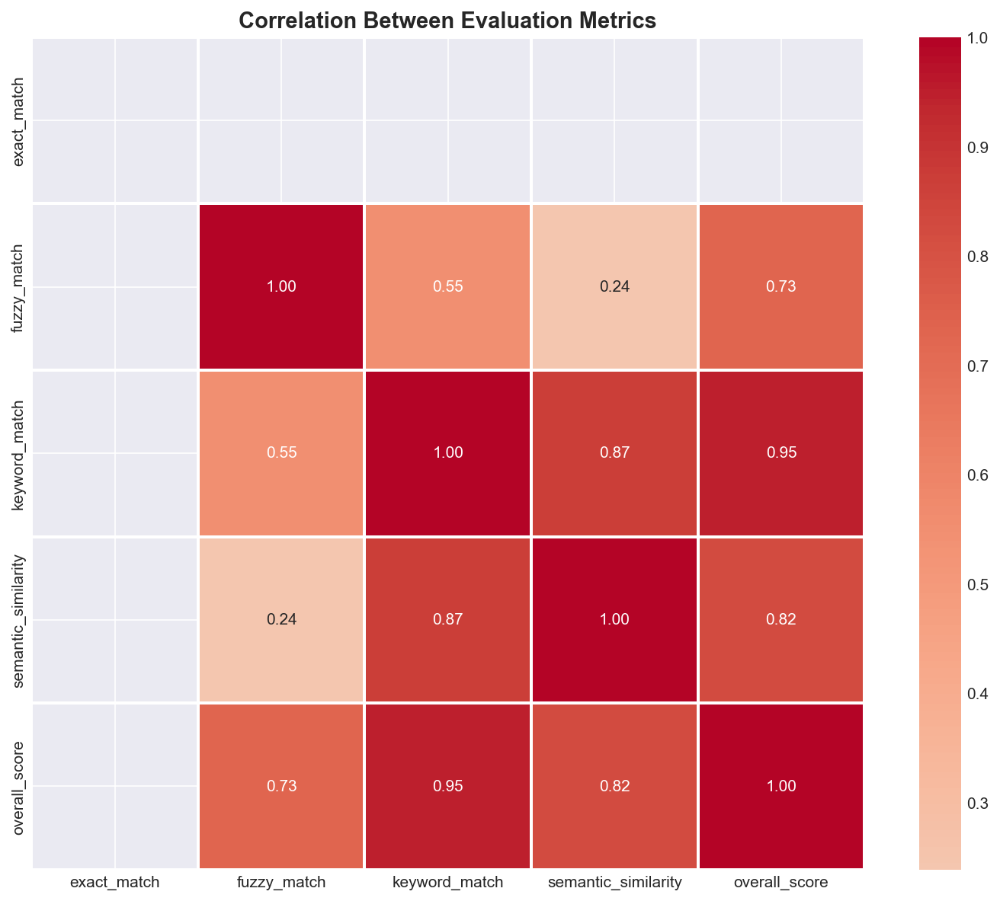
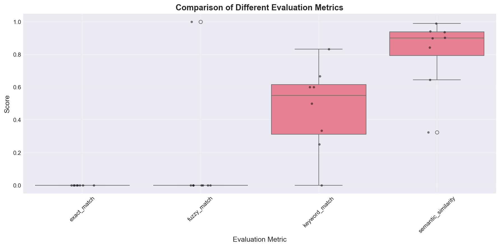

# LLM Evaluation Report
**Generated**: 2025-12-11 02:12:58
**Total Samples**: 8

## Summary Statistics

### Aggregate Scores
| Metric | Mean | Std Dev | Min | Max |
|--------|------|---------|-----|-----|
| semantic_similarity | 0.810 | 0.209 | 0.323 | 0.989 |
| keyword_match | 0.473 | 0.248 | 0.000 | 0.833 |
| exact_match | 0.000 | 0.000 | 0.000 | 0.000 |
| fuzzy_match | 0.125 | 0.331 | 0.000 | 1.000 |
| overall | 0.363 | 0.147 | 0.097 | 0.649 |

## Visualizations

### Score Distribution

### Metric Correlation

### Metric Comparison

## Sample Analysis

### Top 3 Performers
**q6_astronomy** (Score: 0.649)
- Prediction: Jupiter holds the title of biggest planet in our solar system.
- Reference: Jupiter is the largest planet in our solar system.

**q1_geography** (Score: 0.430)
- Prediction: The capital of France is Paris.
- Reference: Paris is the capital of France.

**q4_literature** (Score: 0.401)
- Prediction: Romeo and Juliet was written by William Shakespeare.
- Reference: William Shakespeare wrote Romeo and Juliet.

### Bottom 3 Performers
**q2_science** (Score: 0.097)
- Prediction: It depends on the altitude.
- Reference: Water boils at 100°C at sea level.

**q5_physics** (Score: 0.243)
- Prediction: Light travels at about 3 x 10^8 m/s in vacuum.
- Reference: The speed of light in vacuum is approximately 299,792,458 meters per second.

**q3_astronomy** (Score: 0.338)
- Prediction: Lunar composition includes rocks, dust, and minerals.
- Reference: The Moon is composed of rock, dust, and various minerals.

## Recommendations

1. **Consider metric weights**: Adjust weights based on your use case.
2. **Add custom metrics**: Implement domain-specific evaluation criteria.
3. **Increase dataset size**: More samples provide more reliable statistics.
4. **Benchmark against baselines**: Compare with other LLMs or human evaluations.